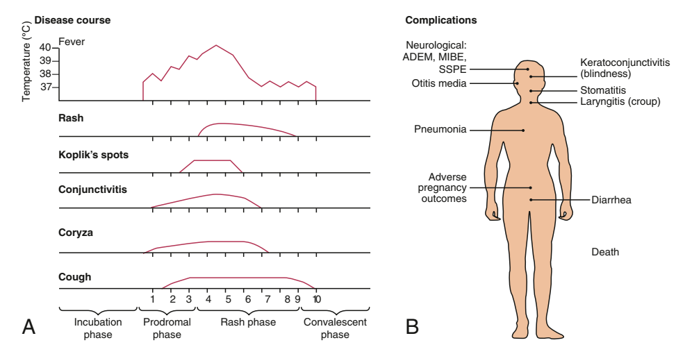

# SOẠN MEASLES

## <mark style="color:orange;">Measles virus = Rubeola virus</mark>

### <mark style="color:orange;">Etiology</mark>

* Virus sởi là <mark style="color:red;">**`virus RNA sợi đơn chiều âm`**</mark>, `có vỏ bao lipid`, thuộc <mark style="color:pink;">**họ Paramyxoviridae**</mark> và <mark style="color:$primary;">**chi Morbillivirus.**</mark>
* **Con người** là <mark style="background-color:yellow;">vật chủ duy nhất</mark> của virus sởi.
* <mark style="color:red;">Có</mark> <mark style="color:red;"></mark><mark style="color:red;">**khả năng lây lan**</mark> <mark style="color:red;"></mark><mark style="color:red;">rất cao</mark>
* Trong sáu protein cấu trúc chính của virus sởi, hai protein quan trọng nhất về khả năng kích thích miễn dịch là <mark style="color:purple;">protein hemagglutinin (H)</mark> và <mark style="color:purple;">protein hòa màng (F).</mark>

### <mark style="color:orange;">Epidemiology</mark>

* Vắc xin sởi đã làm thay đổi sâu sắc dịch tễ học của bệnh sởi.
* **Mức miễn dịch cộng đồng** đối với sởi khoảng <mark style="color:red;">**`95%`**</mark> là <mark style="color:blue;">**cần thiết**</mark> để ngăn chặn sự lan truyền lưu hành của bệnh.

### <mark style="color:orange;">Pathology</mark>

* Nhiễm sởi gây <mark style="color:green;">**`hoại tử biểu mô đường hô hấp`**</mark> kèm theo <mark style="color:cyan;">**`thâm nhiễm tế bào lympho`**</mark>.
* Sởi gây **`viêm mạch máu nhỏ`** ở <mark style="color:pink;">**da**</mark> và <mark style="color:pink;">**niêm mạc miệng**</mark>.
* Mô học của phát ban và ngoại ban cho thấy phù nội bào và loạn sừng, liên quan đến sự hình thành các tế bào khổng lồ hợp bào (syncytial giant cells) ở biểu bì với tối đa 26 nhân. Các hạt virus đã được xác định bên trong các tế bào khổng lồ này.
* Trong mô lưới lympho, tăng sản lympho là đặc điểm nổi bật.
* Sự hòa màng của các tế bào bị nhiễm tạo thành các tế bào khổng lồ đa nhân, gọi là <mark style="color:red;background-color:yellow;">**tế bào khổng lồ Warthin-Finkeldey**</mark><mark style="background-color:yellow;">, dấu hiệu mô bệnh học đặc trưng cho sởi</mark>, có thể chứa tới 100 nhân cùng các thể vùi trong bào tương và trong nhân.

### <mark style="color:orange;">Pathogenesis</mark>

* Nhiễm sởi gồm <mark style="color:green;">**`4 giai đoạn`**</mark>: <mark style="color:purple;">**`thời kỳ ủ bệnh`**</mark> (incubation period), <mark style="color:purple;">**`giai đoạn tiền triệu`**</mark> (prodromal illness), <mark style="color:purple;">**`giai đoạn phát ban`**</mark> (exanthematous phase) và <mark style="color:purple;">**`giai đoạn hồi phục`**</mark> (recovery).
* Trong <mark style="color:purple;">**thời kỳ ủ bệnh**</mark>, virus sởi di chuyển đến các **`hạch lympho vùng`**.
* Tiếp theo là **nhiễm virus huyết tiên phát** (_primary viremia_), làm lan truyền virus đến **`hệ liên võng nội mô`**
* **Nhiễm virus huyết thứ phát** (_secondary viremia)_ làm virus lan đến các **`bề mặt của cơ thể`**.
* <mark style="color:purple;">**Giai đoạn tiền triệu**</mark> bắt đầu sau nhiễm virus huyết thứ phát và liên quan đến hoại tử biểu mô cùng sự hình thành tế bào khổng lồ trong các mô của cơ thể.
* Tế bào bị phá hủy do hiện tượng hòa màng tế bào với tế bào liên quan đến sự nhân lên của virus, xảy ra ở nhiều mô trong cơ thể, bao gồm cả tế bào của hệ thần kinh trung ương.
* <mark style="color:pink;">**Sự thải virus**</mark> bắt đầu từ giai đoạn tiền triệu.
* Khi <mark style="color:cyan;">**ban bắt đầu xuất hiện**</mark><mark style="color:cyan;">, quá trình tạo</mark> <mark style="color:cyan;"></mark><mark style="color:cyan;">**kháng thể**</mark> <mark style="color:cyan;"></mark><mark style="color:cyan;">khởi phát</mark>, đồng thời _<mark style="color:red;">sự nhân lên của virus và các triệu chứng bắt đầu</mark>_ _<mark style="color:$danger;">**giảm dần**</mark>_.
* **Virus sởi cũng&#x20;**<mark style="color:red;">**nhiễm vào**</mark><mark style="color:red;">**&#x20;**</mark><mark style="color:red;">**`tế bào T CD4+`**</mark>, gây <mark style="color:red;">**ức chế**</mark> đáp ứng miễn dịch **`Th1`** và nhiều tác động ức chế miễn dịch khác.
* Virus sởi gắn vào các thụ thể đặc hiệu trên tế bào để xâm nhiễm tế bào vật chủ. Các nghiên cứu trên loài linh trưởng cho thấy những <mark style="background-color:pink;">**đích đầu tiên của virus sởi**</mark> <mark style="background-color:pink;"></mark><mark style="background-color:pink;">là</mark> <mark style="color:orange;background-color:pink;">đại thực bào phế nang</mark><mark style="background-color:pink;">,</mark> <mark style="color:orange;background-color:pink;">tế bào tua</mark> <mark style="background-color:pink;">và</mark> <mark style="color:orange;background-color:pink;">tế bào lympho</mark>. Thụ thể tế bào trên các tế bào này dường như là phân tử hoạt hóa lympho tín hiệu CD150. Sau đó, các tế bào biểu mô hô hấp bị nhiễm thông qua sự gắn kết với thụ thể PVRL4 (Nectin4), được biểu hiện trên các tế bào ở khí quản, niêm mạc miệng, vòm mũi họng và phổi.

### <mark style="color:orange;">Clinical Manifestations</mark>

Sởi là một bệnh <mark style="color:red;">**`nhiễm trùng nghiêm trọng`**</mark>, đặc trưng bởi `sốt cao` (high fever), `ban niêm mạc` (enanthem), `ho` (cough), `sổ mũi` (coryza), `viêm kết mạc` (conjunctivitis) và `phát ban ngoài da` (exanthem) rõ rệt.

<figure><figcaption></figcaption></figure>

> &#x20;                           **Hình**. Diễn tiến bệnh sởi (A) và các biến chứng (B). \
> &#x20;                                         <mark style="color:$info;">ADEM: viêm não tủy mất myelin cấp tính;<mark style="color:$info;"> \
> &#x20;                                         <mark style="color:$info;">MIBE: viêm não thể vùi do sởi;<mark style="color:$info;"> \
> &#x20;                                         <mark style="color:$info;">SSPE: viêm não toàn thể xơ hóa bán cấp.<mark style="color:$info;">

Sau **thời kỳ ủ bệnh** từ `8–12 ngày`, <mark style="color:cyan;">**giai đoạn tiền triệu**</mark> bắt đầu với sốt nhẹ, tiếp theo là xuất hiện viêm kết mạc kèm sợ ánh sáng, viêm mũi xuất tiết, ho rõ và <mark style="color:red;">sốt</mark> <mark style="color:red;"></mark><mark style="color:red;">**tăng dần**</mark>.

<mark style="color:red;">**Hạt Koplik**</mark> (Koplik spots)


<mark style="color:red;">**Hạt Koplik**</mark> (Koplik spots) là <mark style="color:red;">**`biểu hiện của ban niêm mạc`**</mark> và là <mark style="color:yellow;">**dấu hiệu đặc trưng**</mark> chẩn đoán của sởi, xuất hiện 1–4 ngày **trước** khi nổi ban ngoài da.&#x20;

\-  Ban đầu, chúng xuất hiện dưới dạng các <mark style="color:orange;">**`tổn thương đỏ riêng rẽ có chấm trắng xanh ở trung tâm`**</mark>&#x20;

\-  Nằm ở `mặt trong má` ngang mức răng tiền cối, chúng có thể lan đến `môi`, `khẩu cái cứng` và `lợi` ,cũng có thể xuất hiện ở `nếp kết mạc` và `niêm mạc âm đạo`.

\-  Hạt Koplik được ghi nhận trong <mark style="color:red;">**`50–70%`**</mark> trường hợp sởi, nhưng có lẽ xuất hiện ở phần lớn bệnh nhân.



Các triệu chứng tăng dần mức độ trong 2–4 ngày cho đến ngày đầu tiên xuất hiện ban.&#x20;


<mark style="color:red;">**Ban**</mark>&#x20;

Bắt đầu ở <mark style="color:orange;">**`trán (quanh chân tóc), sau tai và vùng cổ trên`**</mark> dưới dạng ban dát sẩn đỏ.&#x20;

Sau đó ban <mark style="color:green;">**`lan xuống thân mình và các chi, đến lòng bàn tay và lòng bàn chân`**</mark> ở tới 50% trường hợp.&#x20;

Ban ngoài da thường liên kết thành <mark style="color:orange;background-color:yellow;">**`mảng ở mặt và phần trên thân mình`**</mark>.&#x20;

**Khi ban bắt đầu xuất hiện**, các triệu chứng bắt đầu <mark style="color:orange;">**giảm dần**</mark>.&#x20;

Ban mờ dần trong khoảng 7 ngày theo đúng trình tự đã lan ra trước đó, thường để lại bong vảy da mịn sau khi lui ban.



Trong các triệu chứng chính của sởi, <mark style="color:$primary;">**`ho kéo dài lâu nhất, thường tới 10 ngày`**</mark>. Trong những trường hợp nặng hơn, có thể có nổi hạch toàn thân, đặc biệt rõ ở hạch cổ và hạch chẩm.

### <mark style="color:orange;">Modified Measles Infection</mark>&#x20;

Ở những người có kháng thể thụ động, như `trẻ nhũ nhi` và `người nhận các chế phẩm máu`, có thể xảy ra thể sởi dưới lâm sàng. Ban có thể không điển hình, tồn tại ngắn hoặc hiếm gặp là hoàn toàn không có.

Tương tự, một số `người đã được tiêm vắc xin` có thể xuất hiện ban nhưng ít triệu chứng khác sau khi phơi nhiễm với sởi.&#x20;

Những người mắc sởi thể biến đổi <mark style="color:red;">**không được xem**</mark> là có khả năng lây truyền cao.

### <mark style="color:orange;">Laboratory Findings</mark>

Chẩn đoán sởi **hầu như** luôn dựa trên các dữ kiện <mark style="color:purple;">**`lâm sàng và dịch tễ học`**</mark>.

Các xét nghiệm trong giai đoạn cấp bao gồm <mark style="color:red;">**giảm tổng số bạch cầu**</mark>, trong đó <mark style="color:$danger;">**`tế bào lympho giảm nhiều hơn bạch cầu trung tính`**</mark>. Tuy nhiên, giảm bạch cầu trung tính tuyệt đối cũng đã được ghi nhận có thể xảy ra.&#x20;

Trong bệnh sởi không kèm biến chứng nhiễm khuẩn thì tốc độ lắng hồng cầu và nồng độ protein C phản ứng thường bình thường.

### <mark style="color:orange;">Diagnosis</mark>

Có thể phân lập virus sởi từ máu, nước tiểu hoặc dịch tiết hô hấp bằng **`nuôi cấy`**

Phát hiện bằng **`sinh học phân tử`** sử dụng phản ứng chuỗi polymerase (PCR) có thể được thực hiện trên bệnh phẩm hút dịch tỵ hầu, ngoáy họng hoặc nước tiểu.


Xác nhận huyết thanh học thuận tiện nhất được thực hiện bằng phát hiện <mark style="color:red;">**kháng thể immunoglobulin M (IgM)**</mark> trong huyết thanh. **Kháng thể IgM** xuất hiện <mark style="color:cyan;">**`sau 1–2 ngày`**</mark> <mark style="color:$primary;">kể từ khi khởi phát ban</mark> và <mark style="color:purple;">còn phát hiện được</mark> trong <mark style="color:purple;">**`khoảng 1 tháng`**</mark>.&#x20;

Nếu mẫu huyết thanh được lấy trong vòng <mark style="color:yellow;">**`<72 giờ sau khi khởi phát ban`**</mark> <mark style="color:yellow;">**và âm tính**</mark> với kháng thể sởi, <mark style="color:red;background-color:yellow;">**nên lấy mẫu thứ hai**</mark>.

Xác nhận huyết thanh học cũng có thể được thực hiện bằng chứng minh <mark style="color:red;">**`hiệu giá kháng thể IgG`**</mark>**&#x20;tăng gấp&#x20;**<mark style="color:red;">**`bốn lần`**</mark> giữa <mark style="color:$primary;">mẫu</mark> <mark style="color:$primary;"></mark><mark style="color:$primary;">**giai đoạn cấp**</mark> <mark style="color:$primary;"></mark><mark style="color:$primary;">và mẫu</mark> <mark style="color:$primary;"></mark><mark style="color:$primary;">**giai đoạn hồi phục**</mark> lấy cách nhau **`2–4 tuần`**.


> * [x] <mark style="color:red;">**Khuyến cáo**</mark> lấy đồng thời mẫu ngoáy họng để làm PCR và mẫu huyết thanh để phát hiện IgM ở tất cả bệnh nhân có biểu hiện lâm sàng phù hợp với sởi.

### <mark style="color:orange;">Differential Diagnosis</mark>

**Sởi điển hình** (Typical measles) <mark style="color:red;">ít có khả năng</mark> bị nhầm lẫn với các bệnh khác, đặc biệt khi quan sát thấy hạt Koplik.

Sởi ở `giai đoạn muộn` hoặc `các thể nhiễm biến đổi` (modified) hay `không điển hình` (atypical) có thể bị nhầm với nhiều bệnh nhiễm trùng hoặc bệnh qua trung gian miễn dịch có phát ban khác, bao gồm <mark style="color:purple;">`rubella, nhiễm adenovirus, nhiễm enterovirus và nhiễm virus Epstein-Barr`</mark>.

Ban đào đột ngột (ở nhũ nhi) (Exanthem subitum: ban đào trẻ em/ ban đỏ đột ngột) và ban đỏ nhiễm khuẩn (ở trẻ lớn hơn) (erythema infectiosum) cũng có thể bị nhầm với sởi.

`Mycoplasma pneumoniae` và `liên cầu nhóm A` cũng có thể gây ban tương tự ban sởi.

<mark style="color:red;">**`Hội chứng Kawasaki syndrome`**</mark> có thể gây nhiều biểu hiện giống sởi nhưng <mark style="color:red;">**không**</mark> <mark style="color:red;"></mark><mark style="color:red;">có các tổn thương riêng biệt trong miệng (</mark><mark style="color:red;">**hạt Koplik**</mark><mark style="color:red;">)</mark>, <mark style="color:pink;">**không**</mark> có ho tiền triệu nặng, và <mark style="color:$primary;">thường gây</mark> <mark style="color:$primary;"></mark><mark style="color:$primary;">**tăng**</mark> <mark style="color:$primary;">**bạch cầu trung tính**</mark> <mark style="color:$primary;"></mark><mark style="color:$primary;">cùng các chất phản ứng pha cấp.</mark> Ngoài ra, tình trạng <mark style="color:yellow;">**tăng tiểu cầu**</mark> đặc trưng của hội chứng Kawasaki syndrome không gặp trong sởi.

**`Phát ban do thuốc`** đôi khi cũng có thể bị nhầm là sởi.

### <mark style="color:orange;">Complications</mark>

Các biến chứng của bệnh sởi **phần lớn** là do tác động gây bệnh của virus lên <mark style="color:red;">**`đường hô hấp`**</mark> và <mark style="color:red;">**`hệ miễn dịch`**</mark>

Tỷ lệ **mắc bệnh và tử vong** do sởi **cao nhất** ở những người `<5 tuổi` (đặc biệt dưới 1 tuổi) và `>20 tuổi`.

**`Nồng độ retinol huyết thanh thấp`** ở trẻ mắc sởi có liên quan đến tỷ lệ mắc bệnh và tử vong do sởi cao hơn tại các nước đang phát triển và tại Hoa Kỳ. <mark style="color:green;">**Nhiễm sởi làm**</mark>**&#x20;**<mark style="color:red;">**giảm**</mark>**&#x20;**<mark style="color:green;">**nồng độ retinol huyết thanh**</mark>, vì vậy các trường hợp thiếu vitamin A tiềm ẩn có thể trở nên biểu hiện triệu chứng trong thời gian mắc sởi.

Viêm phổi là nguyên nhân tử vong thường gặp nhất trong bệnh sởi. Viêm phổi có thể biểu hiện dưới dạng viêm phổi tế bào khổng lồ do virus gây trực tiếp hoặc do bội nhiễm vi khuẩn. Các tác nhân vi khuẩn thường gặp nhất là Streptococcus pneumoniae, Haemophilus influenzae và Staphylococcus aureus. <mark style="color:yellow;">Sau viêm phổi sởi nặng, con đường cuối cùng thường dẫn đến tử vong là</mark> <mark style="color:yellow;"></mark><mark style="color:yellow;">**sự phát triển của viêm tiểu phế quản tắc nghẽn**</mark><mark style="color:yellow;">.</mark>

**Viêm thanh khí phế quản** (Croup)**, viêm khí quản** (tracheitis) **và viêm tiểu phế quản** (bronchiolitis) là những biến chứng thường gặp ở trẻ nhũ nhi và trẻ chập chững biết đi mắc sởi. Mức độ nặng trên lâm sàng của các biến chứng này thường đòi hỏi đặt nội khí quản và hỗ trợ thở máy cho đến khi nhiễm trùng thuyên giảm.


<mark style="color:red;">**Viêm não**</mark> (Encephalitis) sau sởi là một biến chứng đã được ghi nhận từ lâu, thường có tiên lượng không thuận lợi. Tỷ lệ được ghi nhận là `1–3 trường hợp trên 1.000 ca sởi`, <mark style="background-color:yellow;">gặp nhiều hơn ở</mark> <mark style="background-color:yellow;"></mark><mark style="background-color:yellow;">**thanh thiếu niên**</mark> <mark style="background-color:yellow;"></mark><mark style="background-color:yellow;">và</mark> <mark style="background-color:yellow;"></mark><mark style="background-color:yellow;">**người lớn**</mark> so với trẻ tuổi mẫu giáo hoặc tuổi học đường.&#x20;

**Viêm não** là <mark style="color:$primary;">**`quá trình hậu nhiễm`**</mark> do <mark style="color:cyan;">**`cơ chế miễn dịch trung gian`**</mark>, <mark style="color:red;">**không**</mark> phải ~~hậu quả của tác động trực tiếp từ virus~~.

<mark style="color:pink;">**Khởi phát lâm sàng**</mark> bắt đầu <mark style="color:red;">**trong giai đoạn phát ban**</mark> và biểu hiện bằng **`co giật (56%)`**, **`lừ đừ (46%)`**, **`hôn mê (28%)`** và **`kích thích (26%)`**.

<mark style="color:pink;">**Dịch não tủy**</mark> (cerebrospinal fluid) cho thấy <mark style="color:$danger;">**`tăng tế bào lympho`**</mark> ở 85% trường hợp và <mark style="color:$danger;">**`tăng nồng độ protein`**</mark>.

**Viêm não** do sởi `ở bệnh nhân suy giảm miễn dịch` là hậu quả của tổn thương `trực tiếp lên não do virus` gây ra.


